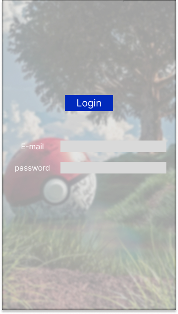

# Santander Bootcamp Project 2024

## Screens
<div>
  
  
</div>

## Diagrama de Classes

```mermaid
classDiagram
  class User {
    - Long id
    - String name
    - int level
    - Account account
    - Profession profession
    - Pokemon[] pokemon
    - News[] news
}
  class Account {
    - Long id
    - String email
    - String password
}
  class News {
    - Long id
    - String title
    - String url
    - String description
}
  class Pokemon {
    - Long id
    - String name
    - int level
    - String element
}
  class Profession {
    - Long id
    - String name
    - int level
}

User "1"-->"1" Account
User "1"-->"1...n" Pokemon
User "1"-->"n" News
User "1"-->"1" Profession


```mermaid
  class User {
    - Long id
    - String name
    - int level
}

